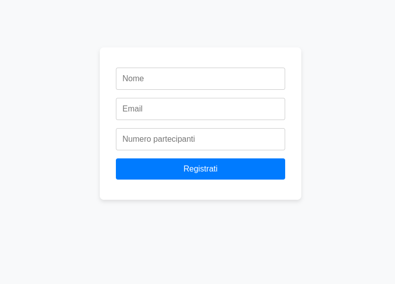
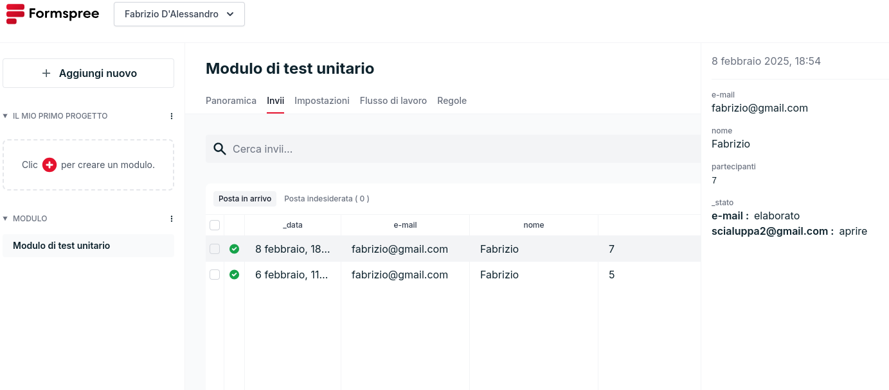

# Registrazione Prenotazioni

Questa applicazione consente di registrare prenotazioni tramite un form, dove l'utente inserisce il proprio nome, la propria email ed il numero di partecipanti. 
Il progetto è stato sviluppato seguendo il paradigma del Test-Driven Development (TDD) e include sia test unitari che di integrazione per garantire il corretto funzionamento delle funzioni di validazione e del flusso di invio dei dati.

## Screenshots

_UnitTest.png)

## Struttura del Progetto

Form/ 
    ├── src/ 
    │   ├── form.js # Funzioni per gestire l'invio del form e la registrazione 
    │   └── validation.js # Funzioni di validazione per i campi del form 
    ├── tests/ 
    │   ├── validation.test.js # Test unitari per le funzioni di validazione 
    │   └── Integration.test.js # Test di integrazione per il flusso completo del form 
    ├── index.html # Interfaccia utente del form di registrazione 
    └── style.css # Foglio di stile per migliorare l'interfaccia utente

## Funzionalità dell'Applicazione

- **Validazione del Form:**  
  Le funzioni di validazione (in `src/validation.js`) verificano che:
  - Il **nome** sia una stringa con almeno 3 caratteri.
  - L'**email** sia valida (contenga un `@` e un dominio con almeno un punto).
  - Il **numero di partecipanti** sia un intero compreso tra 1 e 10 (accettando anche stringhe numeriche, purché convertibili).

- **Invio dei Dati:**  
  Se tutti i campi sono validi, i dati vengono inviati a un endpoint (ad es. Formspree) tramite la funzione `sendRegistration` (in `src/form.js`). 
  In caso di errori di validazione, il form non viene inviato e vengono mostrati i messaggi di errore.

- **Gestione degli Errori:**  
  Se il server restituisce un errore, viene gestito appropriatamente e l'utente viene informato.

### Interfaccia Utente

Il file **index.html** contiene il form per la registrazione, mentre **style.css** ne migliora l'aspetto con uno stile moderno e responsive.

## Esecuzione dei Test

I test sono stati scritti utilizzando **Jest** e comprendono:

- **Test Unitari:**  
  Verificano il corretto funzionamento delle funzioni di validazione in `tests/validation.test.js`.

- **Test di Integrazione:**  
  Testano il flusso completo dell'invio del form (inclusa la simulazione di risposte dal server) in `tests/integration.test.js`.

### Prerequisiti

- [Node.js](https://nodejs.org/)
- [npm](https://www.npmjs.com/)

### Installazione

1. Clona il repository:

   git clone <https://github.com/scialuppa2/CorsoUnitTest_TDD>
   cd Form

2. Installa le dipendenze:   

    npm install

3. Esegui il test:

    npm test

