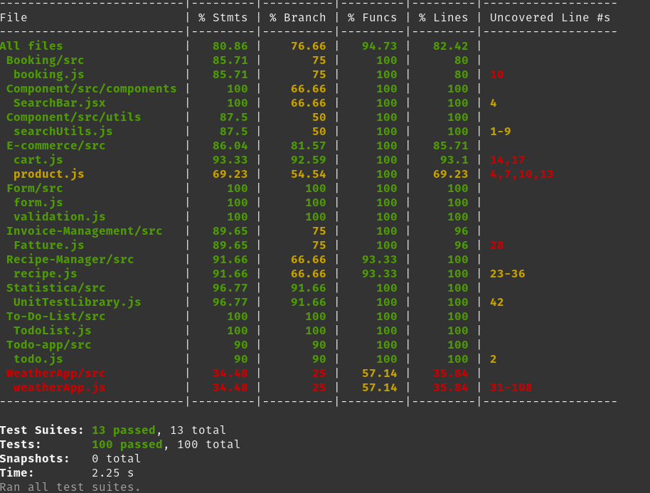

# Unit Test con Metodo TDD

Questa repository contiene gli esercizi svolti durante il corso di **Unit Testing** con il metodo **Test-Driven Development (TDD)**.

## 📁 Struttura della Repository
La repository è organizzata in cartelle, ognuna contenente un esercizio specifico:

- **Booking/** → [Per la prenotazione delle camere]
- **Component/** → [Per la ricerca tramite SearchBar]
- **Form/** → [Per le prenotazioni tramite form]
- **E-commerce/** → [Per la vendita di prodotti]
- **Invoice-Management/** → [Per la gestione delle fatture]
- **Recipe-Manager/** → [Per la ricerca e gestione delle ricette]
- **Statistica/** → [Per il calcolo di media, mediana, moda, varianza, ecc...]
- **To-Do-List/** → [Per le attività svolte/da svolgere]
- **Todo-app/** → [Per l'utilizzo di ESLint per le correzioni del codice]
- **WeatherApp/** → [Per controllare il meteo nelle città]

Ogni esercizio segue il ciclo **TDD**:
1. Scrittura del test 🧪
2. Implementazione del codice 🖥️
3. Refactoring 🔄

## Screenshots del coverage



## 🛠️ Setup e Installazione
Per eseguire gli esercizi, assicurati di avere installato **Node.js** e **npm**. Poi, clona la repository e installa le dipendenze:

```bash
# Clona la repository
git clone https://github.com/tuo-username/unit-test-tdd.git

# Accedi alla cartella del progetto
cd unit-test-tdd

# Installa le dipendenze
npm install
```

## 🚀 Esecuzione dei Test
Ogni esercizio ha i propri test scritti con **Jest**. Per eseguire i test:

```bash
npm test
```

Oppure, se vuoi eseguire i test di un singolo esercizio:

```bash
cd Esercizio-1
npm test
```

